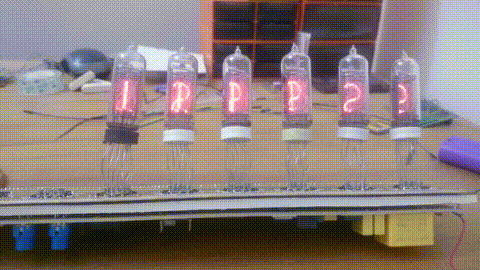

# stm32f103-nixieclock
stm32f103 IN-14 nixie clock

Old IN-14 nixie tubes driving with 74HC595 shift registers 
and high voltage transistors. It also has backup battery. 
See Altium designer schematic and pcb. The high voltage (160 v) 
boost converter in build on pcb.

displaying time/date


divergence meter displaying alpha worldlines (Steins;Gate anime)
The digits are less than the device in anime, so I dropped the left zero
and displayed the dot beside the most left digit. There is a problem with 
the first tube. Some digits are not working. The code is fine though.
I Probably have to resolder some joints.




## How to build
connect stlink/stlinkv2 to debug wire pins and
```
make
make flash
```

##TODO
interrupt code to set time and date
make pcb better
